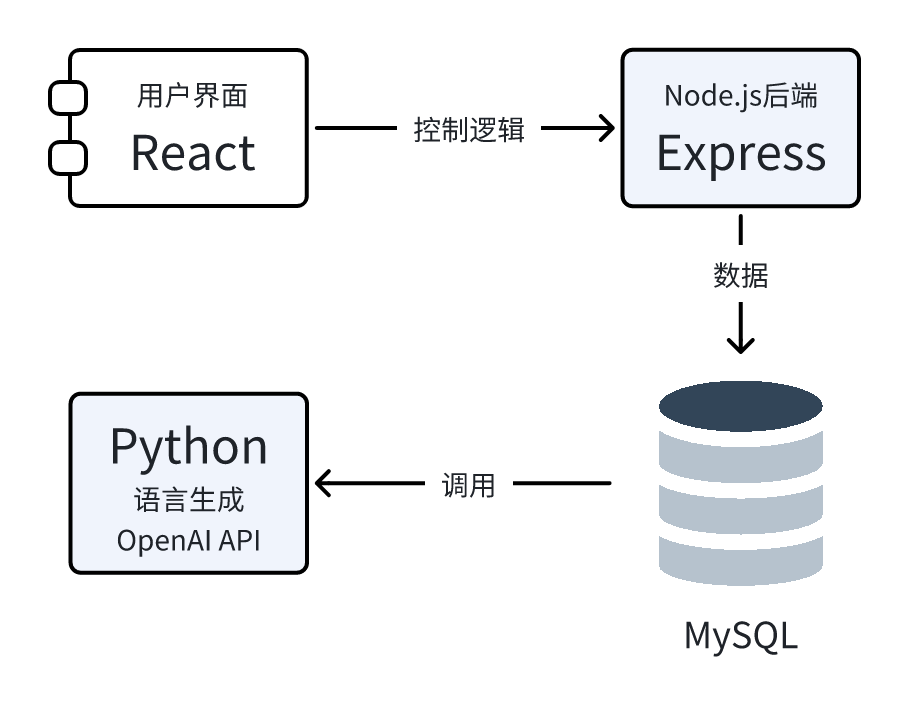

# AI 多智能体辩论系统手册

## 目录

1. [项目简介](#1-项目简介)
   - [1.1 项目目标](#11-项目目标)
   - [1.2 智能体设定与角色选择](#12-智能体设定与角色选择)
   - [1.3 系统功能概览](#13-系统功能概览)
   - [1.4 辩论流程设计](#14-辩论流程设计)
   - [1.5 应用价值与适用场景](#15-应用价值与适用场景)
2. [系统结构](#2-系统结构)
   - [2.1 系统架构图](#21-系统架构图)
   - [2.2 模块组成](#22-模块组成)
   - [2.3 各模块协作流程](#23-各模块协作流程)
   - [2.4 系统特点](#24-系统特点)
3. [部署指南](#3-部署指南)
   - [3.1 环境依赖安装](#31-环境依赖安装)
   - [3.2 配置环境变量](#32-配置环境变量)
   - [3.3 启动服务](#33-启动服务)
   - [3.4 启动注意事项](#34-启动注意事项)
4. [数据库结构说明](#4-数据库结构说明)
   - [4.1 topics 表（辩题表）](#41-topics-表辩题表)
   - [4.2 agents 表（角色表）](#42-agents-表角色表)
   - [4.3 dialogues 表（发言记录表）](#43-dialogues-表发言记录表)
5. [接口说明](#5-接口说明)
   - [5.1 POST /api/debate_1 - 立论阶段](#51-post-apidebate_1---立论阶段)
   - [5.2 POST /api/debate_2 - 辩论阶段](#52-post-apidebate_2---辩论阶段)
   - [5.3 POST /api/debate_3 - 智能体总结](#53-post-apidebate_3---智能体总结)
   - [5.4 POST /api/debate_4 - 主持人总结](#54-post-apidebate_4---主持人总结)
   - [5.5 GET /api/dialogues - 获取第一轮发言](#55-get-apidialogues---获取第一轮发言)
   - [5.6 GET /api/export-latest - 导出辩论内容](#56-get-apiexport-latest---导出辩论内容)
   - [5.7 OpenAI API 外部依赖说明](#57-openai-api-外部依赖说明)
6. [注意事项与建议](#6-注意事项与建议)
   - [6.1 系统运行建议](#61-系统运行建议)
   - [6.2 安全性与合规性](#62-安全性与合规性)
   - [6.3 可拓展建议](#63-可拓展建议)

---


## 1. 项目简介

本系统为基于 RAG（Retrieval-Augmented Generation）架构的多智能体 AI 辩论平台。它通过多个具备固定角色身份的智能体围绕指定辩题开展结构化论辩，自动生成发言、反驳与总结内容，并支持全过程记录、导出与前端可视化展示。

该系统旨在探索多智能体在复杂议题讨论中的立场构建、证据整合与交互生成能力，具备良好的扩展性与研究价值。

---

### 1.1 项目目标

- 构建一个由多角色智能体参与的 AI 辩论系统；
- 引入基于检索增强生成的知识支撑机制；
- 设计结构完整的辩论流程控制逻辑；
- 实现可视化展示与一键导出辩论内容。

---

### 1.2 智能体设定与角色选择

系统预设五类智能体角色，每次辩论可从中任选三位参与：

- 环保主义者
- 经济学家 
- 政策制定者
- 技术乐观主义者  
- 哲学评论者

每个角色具备独立发言风格和观点倾向，通过检索增强模块引用相关资料，生成符合角色视角的发言内容。

---

### 1.3 系统功能概览

| 功能模块 | 描述 |
|----------|------|
| 多角色 Agent 模拟 | 选择任意 3 个角色参与辩论，每个拥有独立身份与语料背景 |
| RAG 文献检索模块 | 动态调用知识库，提取支持观点的权威内容用于生成 |
| 自动化辩论流程 | 系统控制发言轮次、反驳顺序与阶段切换 |
| LLM 观点生成 | 发言由语言模型根据上下文与证据生成，逻辑严密 |
| 前端交错展示 | React 实现仿聊天式左右交错发言与阶段切换视觉效果 |
| 辩论日志导出 | 支持一键导出对话为 `.zip` 包含完整发言与引用数据 |

---

### 1.4 辩论流程设计

系统将一次完整辩论划分为三个阶段与一个主持人总结阶段：

#### 阶段一：立论阶段

- 每个智能体基于角色立场和检索结果，围绕辩题发言一次；
- 发言目标为明确态度与核心主张；
- 用户可以控制发言顺序。

#### 阶段二：辩论阶段

- 每位智能体围绕前轮内容发言三次，共九轮发言；
- 发言形式为回应与反驳，构建观点冲突；
- 所有上下文均作为语言模型输入，保持逻辑延续。

#### 阶段三：总结阶段

- 每个智能体对本方观点和整个辩论进行总结；
- 输出应包含要点回顾、反思与强调立场；

#### 阶段四：主持人总结

- 系统生成一个中立“总结者”角色，对三方总结内容进行整合；
- 输出最终总结语句，表达多方共识或冲突；
- 为使用者或读者提供宏观视角的总结报告。

---

### 1.5 应用价值与适用场景

- 面向学术辅助写作、观点演练、立场博弈建模；
- 适用于具备多元价值冲突或权衡的议题；
- 支持可解释生成、Agent 推理路径追踪等后续研究。

## 2. 系统结构

本系统采用前后端分离 + 数据驱动的架构，后端由 Express 框架搭建，调用多个 Python 脚本生成发言，前端基于 React 实现页面逻辑与展示，数据存储采用 MySQL 数据库。

### 2.1 系统架构图

下图展示了整个系统的核心组件及其交互关系：



> *如图所示，系统主要包括用户界面（前端）、中控逻辑（Node.js）、语言生成模块（Python）、和数据库（MySQL）四大部分。*

---

### 2.2 模块组成

| 模块 | 技术栈 | 功能职责 |
|------|--------|----------|
| 前端 UI 层 | React + Vite | 控制阶段推进、展示智能体发言、头像管理等 |
| 后端控制层 | Node.js + Express | 控制发言流程、连接数据库、调用 Python 发言脚本 |
| 智能体生成模块 | Python + OpenAI API | 每个 Agent 的观点、反驳、总结均由此生成 |
| 数据存储层 | MySQL | 保存 topic、agents、每轮发言等结构化数据 |
| 辩论导出模块 | Python + Archiver | 自动整理生成发言记录压缩包并支持下载 |

---

### 2.3 各模块协作流程

1. 用户提交辩题和所选角色；
2. 后端插入辩题和智能体信息至数据库；
3. 后端根据阶段（立论/反驳/总结）调用不同的 Python 脚本；
4. Python 脚本调用 LLM + 检索系统生成发言并返回 JSON；
5. 后端保存发言至 `dialogues` 表；
6. 前端从接口拉取数据，并交错展示 Agent 发言内容；
7. 用户可点击按钮导出整场辩论为 `.zip` 文件。

---

### 2.4 系统特点

- **模块清晰**：每个环节逻辑独立，便于维护和替换；
- **数据持久化**：所有辩论信息持久保存，支持分析与回放；
- **流程控制完整**：从立论到总结自动推进，模拟真实辩论结构；
- **高度可扩展**：支持添加新 Agent 角色、新阶段、新检索源等。


## 3. 部署指南

本系统采用前后端分离架构，部署步骤包括环境依赖安装、环境变量配置、后端 + 前端启动三部分。建议在 Node.js ≥ 18.0、Python ≥ 3.8 环境中运行。

---

### 3.1 环境依赖安装

#### 后端依赖

在 `/AI-Debate-backend` 目录下执行：

```bash
npm install express
npm install cors
npm install mysql2
npm install dotenv
```

#### Python 依赖

系统中的 Python 脚本位于 `AI-Debate-backend` 目录下，建议使用虚拟环境管理：

```bash
pip install openai
pip install mysql-connector-python
pip install tqdm
pip install requests
```

> 以上仅仅列出了几个需要安装的库的例子，没有全部列出。如需运行 `export_debate.py` 脚本导出内容，请确保 Python 能正常访问 MySQL，并安装 `mysql-connector-python`。

#### 前端依赖

在 `/AI-Debate-frontend` 目录下执行：

```bash
npm install
```

---

### 3.2 配置环境变量

在后端目录下新建或编辑 `.env` 文件，填写以下字段：

```env
# 数据库配置
DB_HOST=localhost
DB_USER=root
DB_PASSWORD=your_mysql_password
DB_NAME=ai_debate

# OpenAI API配置（RAG模块调用）
OPENAI_API_KEY=your_openai_key
OPENAI_API_BASE=https://api.openai.com/v1
```

---

### 3.3 启动服务

依照以下顺序启动系统组件：

#### 启动后端服务

```bash
cd AI-Debate-backend
node app.js
```

服务默认运行在：

```
http://localhost:3001
```

#### 启动前端服务

```bash
cd AI-Debate-frontend
npm run dev
```

前端默认运行在：

```
http://localhost:5173
```

---

### 启动注意事项

- 请确认 `.env` 中数据库信息与 OpenAI 密钥正确；
- 数据库表结构已定义在 `AI-Debate-backend/database.sql`，可用以下命令导入：

```bash
mysql -u root -p ai_debate < database.sql
```

- Python 与 Node.js 使用的依赖较轻，但建议按模块使用虚拟环境隔离；
- 所有 Python 脚本均支持命令行调用，运行时依赖与 `app.js` 同级目录结构一致。


## 4. 数据库结构说明

本系统使用 MySQL 数据库，共包含三个主表：`topics`（辩题表）、`agents`（智能体信息表）、`dialogues`（发言记录表）。所有主键均为自增字段，字段设计具备良好的结构化与可扩展性。

---

### 4.1 `topics` 表（辩题表）

用于记录系统内的所有辩题内容。

| 字段名   | 类型  | 描述         |
|----------|-------|--------------|
| id       | INT   | 辩题 ID，自增主键 |
| content  | TEXT  | 辩题文本内容 |

---

### 4.2 `agents` 表（角色表）

记录参与某一辩题的各智能体角色及其发言顺序。

| 字段名      | 类型         | 描述                         |
|-------------|--------------|------------------------------|
| id          | INT          | 智能体 ID，自增主键          |
| topic_id    | INT          | 外键，关联 `topics(id)`     |
| name        | VARCHAR(255) | 智能体名称，如“经济学家”     |
| order_index | INT          | 发言顺序，从 1 开始           |

---

### 4.3 `dialogues` 表（发言记录表）

保存智能体在不同轮次的发言内容及引用文献。

| 字段名           | 类型  | 描述                                               |
|------------------|-------|----------------------------------------------------|
| id               | INT   | 记录 ID，自增主键                                  |
| topic_id         | INT   | 外键，关联辩题                                     |
| agent_id         | INT   | 外键，关联智能体                                   |
| round_id         | INT   | 发言轮次：1（立论）2（辩论）3（总结）4（主持人总结） |
| utterance_index  | INT   | 在当前轮次中的发言顺序编号                         |
| conclusion       | TEXT  | 智能体发言内容                                     |
| references_json  | TEXT  | 引用文献，存储为 JSON 字符串                      |

---

### 🔗 外键关系说明

- `agents.topic_id` → `topics.id`
- `dialogues.topic_id` → `topics.id`
- `dialogues.agent_id` → `agents.id`

所有外键字段均开启约束，确保数据一致性。

---

### 示例建表语句参考

```sql
CREATE TABLE topics (
    id INT AUTO_INCREMENT PRIMARY KEY,
    content TEXT NOT NULL
);

CREATE TABLE agents (
    id INT AUTO_INCREMENT PRIMARY KEY,
    topic_id INT NOT NULL,
    name VARCHAR(255) NOT NULL,
    order_index INT NOT NULL,
    FOREIGN KEY (topic_id) REFERENCES topics(id)
);

CREATE TABLE dialogues (
    id INT AUTO_INCREMENT PRIMARY KEY,
    topic_id INT NOT NULL,
    agent_id INT NOT NULL,
    round_id INT NOT NULL,
    utterance_index INT NOT NULL,
    conclusion TEXT,
    references_json TEXT,
    FOREIGN KEY (topic_id) REFERENCES topics(id),
    FOREIGN KEY (agent_id) REFERENCES agents(id)
);
```
）

## 5. 接口说明

本系统后端基于 Express 构建，所有接口前缀为 `/api/`。接口主要用于前后端通信及调用 Python 模块完成各阶段辩论生成与数据获取。以下为各主要 API 说明。

---

### 5.1 `POST /api/debate_1` - 第一阶段：立论

用于初始化辩题与角色，并生成每位智能体的立论发言。

#### 请求参数（JSON）：

```json
{
  "topic": "是否应禁止发展类人机器人",
  "agents": [
    { "name": "环保主义者", "order": 1 },
    { "name": "经济学家", "order": 2 },
    { "name": "政策制定者", "order": 3 }
  ]
}
```

#### 返回示例：

```json
{
  "success": true,
  "topic_id": 1
}
```

---

### 5.2 `POST /api/debate_2` - 第二阶段：辩论

每位智能体基于上下文轮流发言三次，总共 9 条回应。

#### 请求参数：

```json
{
  "topic": "是否应禁止发展类人机器人",
  "topic_id": 1,
  "agents": [
    { "name": "环保主义者" },
    { "name": "经济学家" },
    { "name": "政策制定者" }
  ]
}
```

#### 返回示例：

```json
{
  "success": true,
  "dialogues": [
    {
      "name": "经济学家",
      "text": "...",
      "references": [...]
    }
  ]
}
```

---

### 5.3 `POST /api/debate_3` - 第三阶段：智能体总结

调用 Python 脚本，生成每位智能体对整场辩论的总结性发言。

#### 请求参数：

与 `/api/debate_2` 相同

#### 返回示例：

```json
{
  "success": true,
  "summaries": [
    {
      "name": "哲学评论者",
      "text": "...",
      "references": [...],
      "key_points": [...]
    }
  ]
}
```

---

### 5.4 `POST /api/debate_4` - 主持人总结

综合所有智能体的总结，由系统生成“总结者”角色的最终总结发言。

#### 请求参数：

与 `/api/debate_3` 相同

#### 返回示例：

```json
{
  "success": true,
  "conclusion": "...",
  "references": [...],
  "key_points": [...]
}
```

---

### 5.5 `GET /api/dialogues?topic_id=1` - 获取第一轮发言

获取指定 `topic_id` 对应的所有立论发言内容（round_id = 1）。

#### 返回示例：

```json
{
  "success": true,
  "dialogue": [
    {
      "name": "技术乐观主义者",
      "text": "...",
      "references": [...]
    }
  ]
}
```

---

### 5.6 `GET /api/export-latest` - 导出辩论内容

调用 `export_debate.py` 将最新辩论数据导出并压缩为 zip 文件。

#### 返回类型：

- `.zip` 文件下载（包含结构化文本与引用文献）

---

### 5.7 外部依赖接口：OpenAI API

所有智能体发言均通过调用 Python 脚本访问 OpenAI API 接口生成。

---

### 注意事项

- 所有发言结果均为 JSON 格式返回；
- 请求中若参数缺失，后端将返回 400 错误；
- Python 脚本调用 OpenAI API 受密钥权限和速率限制约束，请妥善保管密钥；
- 导出功能依赖文件写权限和 MySQL 连接状态，请确保后端与数据库连接稳定。


## 6. 注意事项与建议

为保证系统稳定运行与便于后续维护部署，以下列出系统使用过程中需关注的注意事项与建议：

---

### 系统运行建议

- **Node.js 与 Python 版本建议**：推荐使用 Node.js ≥ 18.0，Python ≥ 3.8；
- **数据库连接稳定性**：确保 `.env` 配置中的数据库信息填写无误，并保证数据库服务已开启；
- **API 密钥管理**：OpenAI API Key 请勿上传至公开仓库，建议通过环境变量或密钥管理工具加载；
- **端口使用冲突**：后端默认使用 3001 端口，前端默认使用 Vite 的 5173 端口，使用前请确保无端口冲突；
- **数据库初始化**：首次部署前请务必运行 SQL 脚本创建数据表结构（见 `database.sql`）；
- **导出功能**：导出功能需确保 Python 脚本 `export_debate.py` 有文件系统写权限，Linux 下建议使用 `chmod +x` 授权。

---

### 安全性与合规性

- 所有智能体发言均通过 OpenAI API 调用生成，调用记录受 OpenAI 服务协议约束；
- 如进行长时运行或批量生成，建议设置 API 调用速率限制或加入缓存机制；
- 不建议将系统用于生成敏感、歧视性或误导性言论，使用者应遵循伦理规范。

---

### 可拓展建议

- 可添加更多智能体角色，通过配置角色库并关联特定提示词模板实现；
- 可接入自建 RAG 检索系统以替代 OpenAI Embedding API；
- 可扩展总结模块为多层结构，如个人总结 + 组间回应 + 专家回顾；
- 可考虑引入评分模块，对发言进行实时逻辑性与相关性评估。

---
